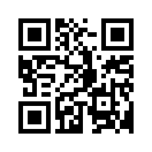

Qr Reader activity for XO
=========
How it works 
You need to focus the Qr Code in the camera, and then press the "Turn on/off the camera" button 
 
When you have a Qr Code, you can copy it pressing the "Copy link to clipboard" button. 

Sugar Labs Qr Code
========
You can use the Sugar Labs Qr Code 

